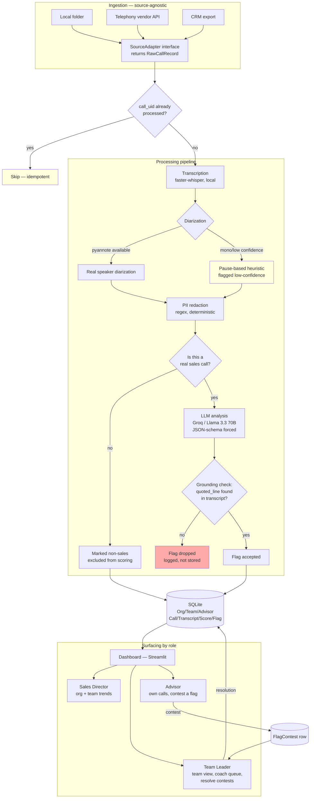

```mermaid
flowchart TD
    subgraph SRC["Ingestion — source-agnostic"]
        A1[Local folder]
        A2[Telephony vendor API]
        A3[CRM export]
        A1 & A2 & A3 --> ADAPTER[SourceAdapter interface\nreturns RawCallRecord]
    end

    ADAPTER --> DEDUPE{call_uid already\nprocessed?}
    DEDUPE -- yes --> SKIP[Skip — idempotent]
    DEDUPE -- no --> TRANS

    subgraph PIPE["Processing pipeline"]
        TRANS[Transcription\nfaster-whisper, local] --> DIAR{Diarization}
        DIAR -- pyannote available --> DIAR_REAL[Real speaker diarization]
        DIAR -- mono/low confidence --> DIAR_FALLBACK[Pause-based heuristic\nflagged low-confidence]
        DIAR_REAL --> REDACT
        DIAR_FALLBACK --> REDACT[PII redaction\nregex, deterministic]
        REDACT --> SALESCHECK{Is this a\nreal sales call?}
        SALESCHECK -- no --> NONSALES[Marked non-sales\nexcluded from scoring]
        SALESCHECK -- yes --> ANALYZE[LLM analysis\nGroq / Llama 3.3 70B\nJSON-schema forced]
        ANALYZE --> GROUND{Grounding check:\nquoted_line found\nin transcript?}
        GROUND -- no --> DROP[Flag dropped\nlogged, not stored]
        GROUND -- yes --> ACCEPT[Flag accepted]
    end

    ACCEPT --> DB[(SQLite\nOrg/Team/Advisor\nCall/Transcript/Score/Flag)]
    NONSALES --> DB
    DB --> DASH[Dashboard — Streamlit]

    subgraph ROLES["Surfacing by role"]
        DASH --> DIR[Sales Director\norg + team trends]
        DASH --> LEAD[Team Leader\nteam view, coach queue,\nresolve contests]
        DASH --> ADV[Advisor\nown calls, contest a flag]
    end

    ADV -- contest --> CONTEST[(FlagContest row)]
    CONTEST --> LEAD
    LEAD -- resolution --> DB

    style DROP fill:#faa
    style SKIP fill:#ffd
    style DIAR_FALLBACK fill:#ffd
```
